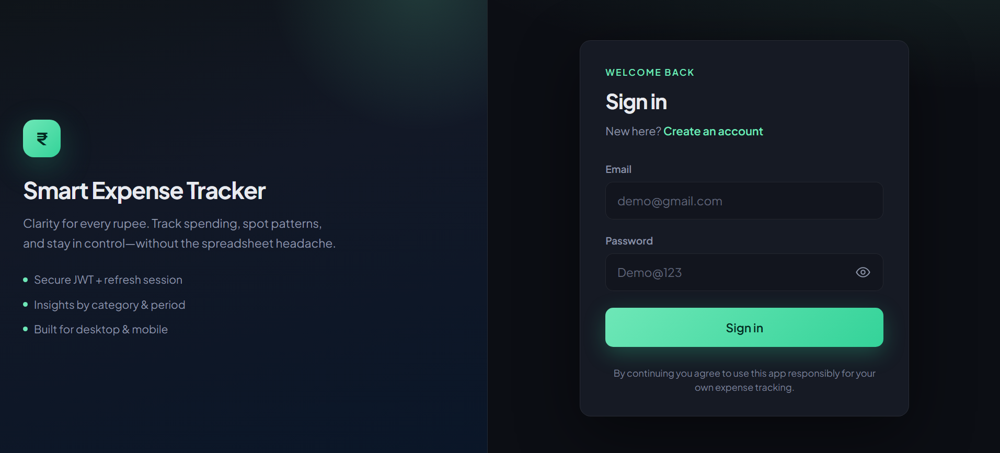
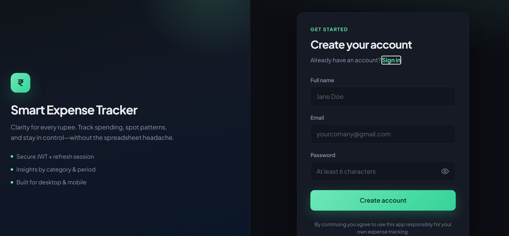
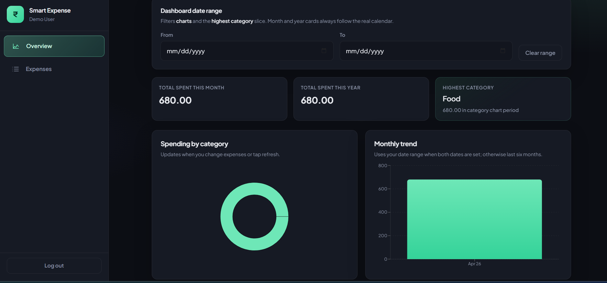
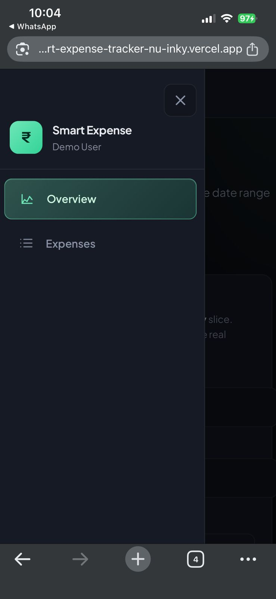

# Smart Expense Tracker (Production-Ready Assignment)

Full-stack expense tracking application designed for job evaluation submission.

---

## Live deployment

| | |
| --- | --- |
| **GitHub repository** | `https://github.com/Saini-Gaurav/smart-expense-tracker` |
| **Frontend (Vercel)** | `https://smart-expense-tracker-nu-inky.vercel.app` |
| **Backend API (Render)** | `https://smart-expense-tracker-ei6b.onrender.com` |
| **API health check** | `https://smart-expense-tracker-ei6b.onrender.com/api/health` |

### Backend on Render (free tier)

The API runs on **Render’s free tier**, which **spins down when idle**. After sleep, the **first** request can take **~30–60 seconds** (cold start) while the service wakes; later requests are normal. This is expected for free hosting, not a broken deploy. If a reviewer sees a slow first load, they can wait and retry, or hit `/api/health` once and then use the app.

---

## Demo credentials (for reviewers)

Register this user on your **deployed** frontend once, then keep the same values here (use a dedicated demo account).

| | |
| --- | --- |
| **Email** | `demo@gmail.com` |
| **Password** | `Demo@123` |

---

## Screenshots

Save PNGs in **`docs/screenshots/`** using these **exact filenames**, commit, and push. Until the files exist, GitHub may show broken image icons — that is normal until you add the pictures.

| File name | Label (what reviewers see above) |
| --- | --- |
| `login.png` | Login page — sign in with email and password |
| `register.png` | Register page — create account |
| `overview-dashboard.png` | Overview dashboard — summary cards, date range, and charts |
| `expenses-list.png` | Expenses — filters, sort, and paginated list |
| `add-or-edit-expense.png` | Add or edit expense — modal with title, amount, category, date, notes |
| `mobile-drawer.png` | Mobile layout — sidebar drawer or narrow viewport |

---

## Tech Stack

- Frontend: **TypeScript**, React + Vite (`main.tsx`), React Router, Axios, **Recharts**, responsive sidebar (drawer on small screens; fixed sidebar + scrollable main on desktop)
- Backend: **TypeScript**, Node.js, Express, MongoDB, Mongoose (`tsx` in dev, `tsc` for production build → `dist/`)
- Security: Helmet, CORS, rate limit, JWT access + refresh tokens (httpOnly cookie)
- Architecture: Routes → Controllers → Services → Repositories → Models

## Project Structure

- `frontend` — responsive SPA with authentication and expense dashboard
- `backend` — REST API with modular production-style architecture under `src`

## Features (assignment-aligned)

- Authentication: secure signup & login (bcrypt + JWT on API)
- Expenses: add (title, amount, category, date, optional notes), **edit**, delete
- List: **pagination (10 per page)**, **date range** + **category** filters, **sort** by date or amount (asc/desc)
- Categories: Food, Transport, Shopping, Health, Entertainment, Utilities, Other
- Dashboard: **summary cards** (this month, this year, highest category), **date range** for charts/list, **dynamic charts** (category + monthly trend) that refresh after changes
- Access token + refresh token flow (API)
- Server-side `express-validator`, structured logging
- Responsive UI

## Local setup

1. Install dependencies:
   - `cd backend && npm install`
   - `cd ../frontend && npm install`
2. Configure env:
   - Copy `backend/.env.example` to `backend/.env` and fill values
   - Copy `frontend/.env.example` to `frontend/.env` and set `VITE_API_URL` (e.g. `http://localhost:5000/api` for local API)
3. Run apps:
   - Backend: `cd backend && npm run dev`
   - Frontend: `cd frontend && npm run dev`

**Detailed docs:** [backend/README.md](backend/README.md) and [frontend/README.md](frontend/README.md).

**First-time users:** use **Create an account** on the login screen (or `/register`) before signing in.

## Submission checklist (assignment brief)

1. **GitHub** — Public repo, clear commit history, README with setup, env notes, and screenshots (see above).
2. **Live URLs** — Frontend and backend deployed; links in **Live deployment** at the top.
3. **`.env.example`** — Present in `backend/` and `frontend/` (no real secrets committed).
4. **Demo credentials** — Table filled so reviewers can log in on the **live** app.

## API Endpoints

- `POST /api/auth/register`
- `POST /api/auth/login`
- `POST /api/auth/refresh`
- `POST /api/auth/logout`
- `GET /api/auth/me`
- `GET /api/expenses`
- `POST /api/expenses`
- `PUT /api/expenses/:id` (full update)
- `PATCH /api/expenses/:id` (partial update)
- `DELETE /api/expenses/:id`
- `GET /api/expenses/summary`

## MongoDB / Atlas note

If connection fails with DNS issues, verify internet, valid Atlas URI (full hostname), URL-encoded password in the URI, and **Network Access** allow list on Atlas.
